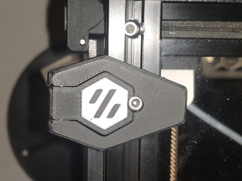
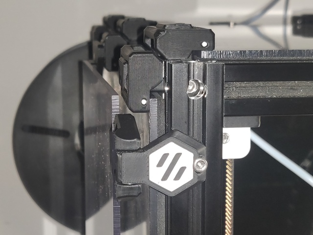
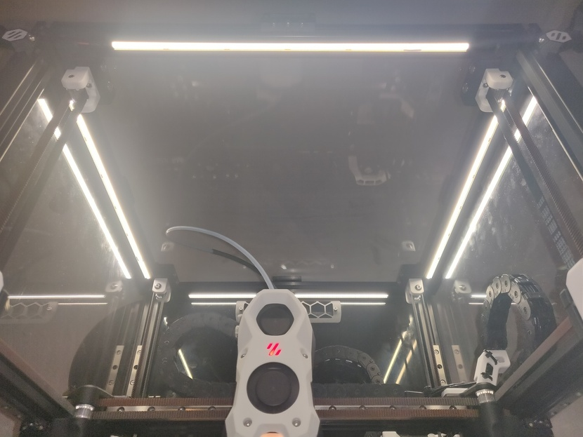

# Voron Mods

## 270° Magnetic Hinges

These hinges are designed to go together with [quick-release panel latches].
They open 270° and leave just enough clearance around the latches. Plus, they
are magnetic, so they detach quickly.

Three options for printing:

- Print as-is to get a flat version without the logo
- Split into parts and delete the inlay to get a relief Voron logo
- Print the inlay in accent color to get a nice colorized Voron logo

### Known issues

- In the current version, the stem that goes into the extrusion is juuuust a bit
  too short, which causes the doors to slightly bind.
- Friction on the magnets can cause the coating to deteriorate. My solution was
  to add a layer of electrical tape.

[quick-release panel latches]: https://github.com/VoronDesign/VoronUsers/tree/master/printer_mods/richardjm/snap-latch-2020

## Invisible LED rails

I wanted to have LED rails that provide lots of light to see what I'm printing,
but don't obstruct the view and are generally as invisible as possible. I found
these [8mm COB LED strips] that just slide into the 2020 extrusions, so I
printed a backing strip that ensures they sit tight and don't move around.

For the 250mm Voron build, use 4x30cm of LED strip. Connect them in one row with
10cm of cable in between. Route the cable from the electronics compartment up in
one extrusion. Then disassemble the top extrusions one after the other, slide
the LED strip in, and reattach. Note that these LED strips come in pieces of
50cm that are soldered together. It's a good idea to avoid the soldering joints
as they will sit against the extrusions, even though this will waste a bit of
LED strip.

For routing the cables from the vertical extrusions to the electronics
compartment, I used the [Hidden Cable Z Belt Covers].

For hiding the cables around the Z eyedlers, I designed my own covers that clip
into the 2020 extrusions. Split the STL into its parts and print the springs
flat, otherwise they will delaminate. The springs should just slide into the
grooves.

[8mm COB LED strips]: https://www.amazon.de/gp/product/B089N6FLM1/
[Hidden Cable Z Beld Covers]: https://github.com/VoronDesign/VoronUsers/tree/master/printer_mods/Akio/cable_routing_z_belt_cover
